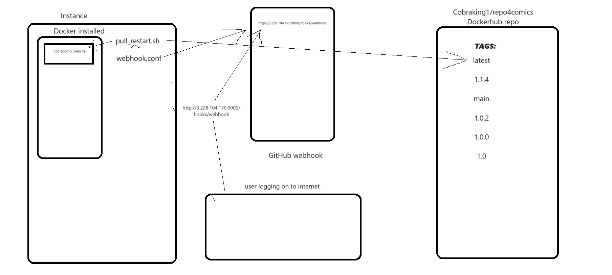

PART 1

1.My goal is to push my tag changes into my Dockerhub repository. one of the the resources is to use the metadata to help us create a group of tags for a certain image. this is to keep changes of our image on Dockerhub. We do this so we can use them later such as if we need to use a newer tag that can work on an older image, that should work for us.

2. To generate a tag in my github repository I just went onto wsl and typed down the command of: 

    "git tag -a v1.0.2" 

it then sent me to an aditing page where I typed down "practicing making a tag on github" I thensaved my changes and went back to my normal screen on wsl, I then had to push the new tag to github by typing down the following command:

    "git push origin v1.0.2"

if you then go to my github repository and click "main" and switch to the branches tab you will then see my new tag version of v1.0.2 that I created and pushed.

3.  on the top of my workflow, in the "on" section is the metadata action section. the workflow works if you push into the main branch ,with any tag available, or if you do a pull request on the main branch.

the first step uses the actions/checkout@v3, which will help me take a check for my repo onto the runner, which will help me run all of my scripts as well as my actions.

the second step simply lists all of my file and my folders in my f23cicd-hulkman125 repository for people to see.

The third step uses the docker/login-action@v2 action which will use my Username and my token from Dockerhub to login to docker for future use in this workflow.

The fourth step uses the docker/setup-buildx-action@v2 to both create and boot up a builder.

The fifth step uses a docker/metadata-action@v4 command which uses my image of cobraking1/repo4cobra that I created mfrom my dockerfile to extract metadata from both Git reference and Github events. It also uses a specific tag that that it referneces.

The sixth and final step uses a docker/build-push-action@v3 command to build and push any image and any tag i create to my Dockerhub account.

4. To prove that there is a tag in my github repo, here is a link to it:

    https://hub.docker.com/repository/docker/cobraking1/repo4cobra/tags?page=1&ordering=last_updated

The Ip of the instance I use is 3.228.104.170

PART 2
The goal here is to install docker on my instance and use it with my webhook configuration file and my script to allow other people to see my website online by typing down the IP address of my instance with :80. FYI I asked other people to look at my website and they were impressed as was I.

1. To install docker on an instance you simply type down the following command of:
    sudo apt-get update

then I type down :

    sudo apt install docker

2. To pull my image from dockerhub i type down the following command:

    sudo docker pull cobraking1/repo4cobra:latest

To run a container I typed down the following:

    sudo docker run -d -p 8282:5000 --name cobraComix_Website cobraking1/repo4cobra:latest

But I created a restart script called pull_restart.sh that runs my docker container. And that script is on my /home/ubuntu folder on my instance.

3. to install webhook on an instance i typed down:

    sudo apt install webhook

then type down:

    go install github.com/adnanh/webhook@latest

4. my webhook task definition file has an id of "CobraComix", and it has an execute-command that activates my pull_restart.sh script.

My webhook file was originally called hooks.json and it was going to be on my home/ubuntu folder but I used the following command to copy it to a different folder of /etc/webhook.conf.:

        sudo cp hooks.json /etc/webhook.conf

it is designed to activate my script of  pull_restart.sh.

5. To configure DockerHub to message a listener I went to my instance and in /etc/hooks.conf i added a trigger rule with a secret of "mysecret" which will be used by github webhooks to see use the configuration file if the event is used. I then went to my github repo and I then went to settings/webhook where I gave it a Payload URL of "http://3.228.104.170:9000/hooks/webhook". I then left it as a push event and clicked the "Update webhook" button sealing my webhook.

this is my image of my work for project 5:
      

Have a pleasent day Professor Duncan, and Happy Holidays.
